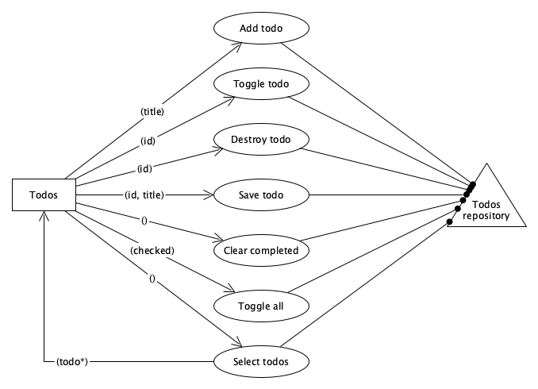
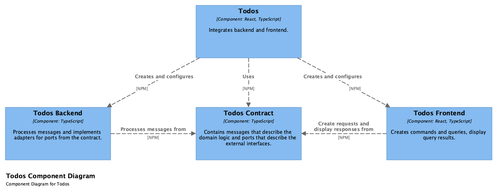
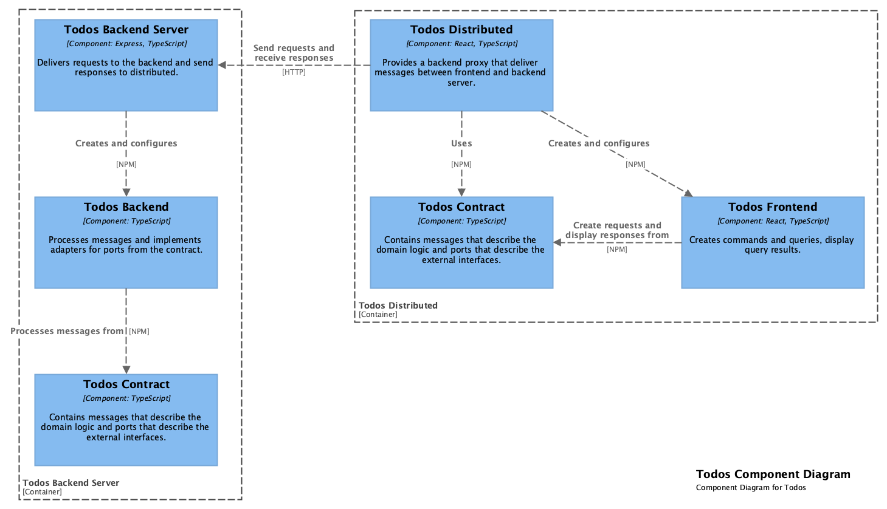

# Todos

A simple app for managing todos, following the example of
[TodoMVC](https://todomvc.com).

## Stories

### Create todo

- Add todo (title)
  - When the app starts, then focus new todo text field.
  - When the title starts or ends with whitespace, then remove them before
    saving.
  - When the title is empty, then no todo will be created.
  - When there are no todos, then only show new todo text field.
- Select todos (todos{id, title, completed}[])
  - When todos exist, then show number of active todos.
  - When a todo is completed, then display title strikethrough.
  - When a filter set, then only active or completed todos will be displayed.

### Complete todo

- Toggle todo (id)
  - When a todo is active, then mark it as completed.
  - When a todo is completed, then mark it as active.
- Toggle all (checked)
  - When all todos are completed, then toggle all is checked.
  - When toggle all is checked, then all todos will be set active.
  - When toggle all is not checked, then all todos will be set completed.

### Edit todo

- Save todo (id, title)
  - When double-click the todo, then activate editing mode.
  - When editing mode is activated, then focus title text field.
  - When press `Enter`, then save the edit.
  - When text field lose focus, then save the edit.
  - When press `Escape`, then cancel edit without save.
  - When the title starts or ends with whitespace, then remove them before
    saving.
  - When the title is empty, then the todo will be destroyed.

### Remove todo

- Destroy todo (id)
  - When hover over the todo, then show the remove button.
- Clear completed
  - When there are no completed todos, then hide clear completed button.

## Design

The design is visualized with [Flow Design](https://flow-design.info).

## Modules

The modules are described with [C4 model](https://c4model.com). The follo
architecture pattern: Ports and Adapters

### Todos

### Todos Distributed

